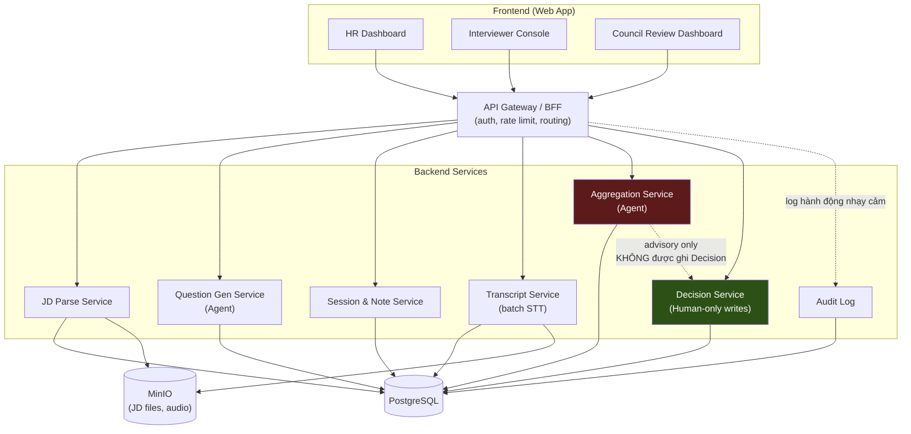
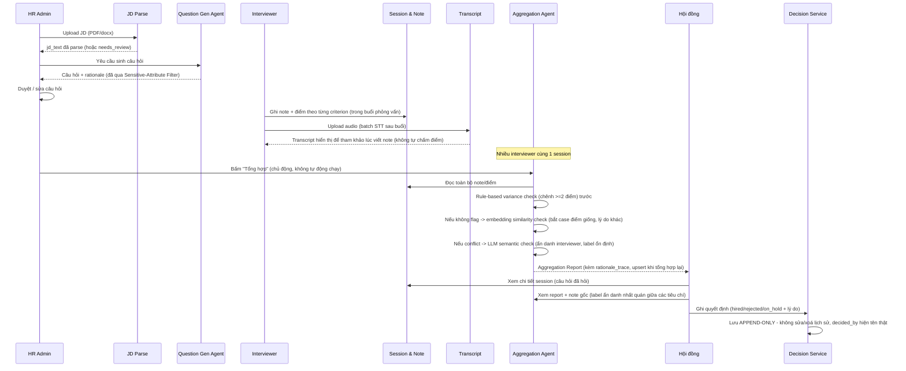
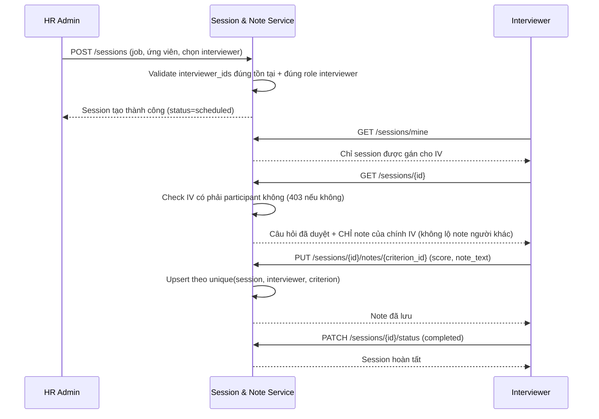
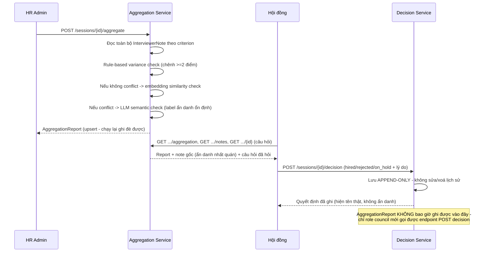
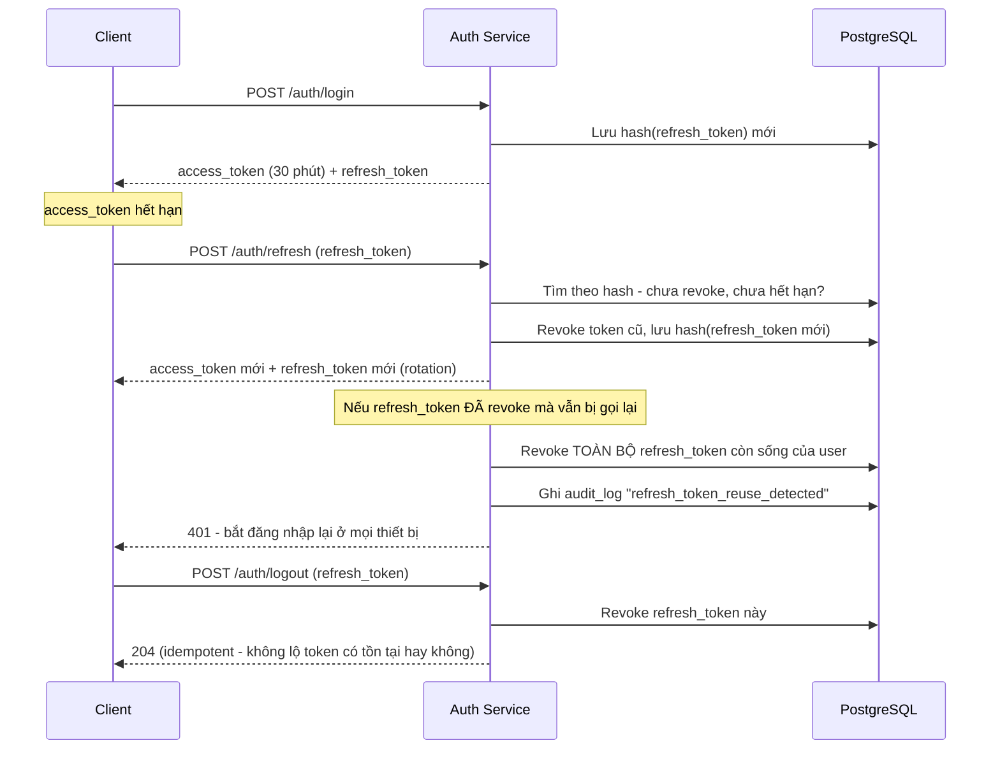

# Kiến trúc hệ thống

## Trạng thái implement theo service

| Service | Trạng thái | Sprint |
|---|---|---|
| Auth (JWT + Refresh Token + RBAC) | ✅ Đã có | 3, rà soát toàn bộ ở 6, nâng cấp refresh token sau MVP |
| JD Parse Service | ✅ Đã có | 1 |
| Question Gen Service | ✅ Đã có | 2 |
| Session & Note Service | ✅ Đã có | 3 |
| Transcript Service (batch STT) | ✅ Đã có | 4 |
| Aggregation Service | ✅ Đã có | 5 |
| Decision Service | ✅ Đã có | 6 |
| Audit Log | ✅ Đã có | 6 |

**MVP hoàn thiện** — toàn bộ service trong Phân tích ban đầu đã có migration + API +
test thật, không còn mục nào ở trạng thái kế hoạch.

Auth bổ sung 1 lớp kiểm tra trước khi request chạm tới các service ở trên: mọi
endpoint (trừ `/health`, `/auth/login`, `/auth/refresh`) đều qua `get_current_user`
(giải mã JWT, load `User`, kiểm tra `is_active`) và phần lớn còn qua
`require_role(...)` chặn theo đúng role cần thiết (VD: chỉ `hr_admin` tạo được
Job/Framework/Session; chỉ interviewer được gán mới đọc/ghi note của session đó;
Council đọc được chi tiết session + report tổng hợp nhưng không đổi được trạng
thái session hay đụng transcript). Sprint 6 rà soát lại toàn bộ endpoint theo
bảng actor gốc — phần lớn đã đúng nhờ các lần fix tích luỹ ở Sprint 3-5, đặc biệt
việc gom logic phân quyền session vào `app/services/session_access.py` dùng
chung thay vì lặp lại ở từng router (tránh tái diễn lỗi thiếu nhánh `elif` từng
gặp phải).

**Sau MVP: nâng cấp access token + refresh token.** JWT (`access_token`) trước
đây là cơ chế xác thực duy nhất, hạn dùng cố định (`jwt_expire_minutes`) và không
thể thu hồi giữa chừng (JWT tự thân không lưu trạng thái). Nâng cấp thêm
`refresh_token` (random string, lưu **hash SHA-256** trong bảng `refresh_token`,
không lưu token gốc — cùng nguyên tắc với `password_hash`):

- `access_token` giữ hạn **ngắn** (30 phút) — giới hạn thiệt hại nếu bị lộ, vì
  không thể thu hồi giữa chừng.
- `refresh_token` dùng để cấp `access_token` mới qua `POST /auth/refresh`, có
  **rotation**: mỗi lần refresh thành công, token cũ bị revoke ngay và cấp token
  mới — 1 refresh token chỉ dùng được đúng 1 lần.
- **Phát hiện refresh token bị dùng lại** (`revoked_at` đã có giá trị mà vẫn bị
  gọi) — dấu hiệu token có thể đã bị đánh cắp. Xử lý: revoke **toàn bộ** refresh
  token còn sống của user đó, buộc đăng nhập lại ở mọi thiết bị, không chỉ báo
  lỗi đơn thuần.
- `POST /auth/logout` revoke refresh token — đây là cách "đăng xuất" có hiệu lực
  thật sự (access_token cũ, nếu còn hạn, vẫn dùng được tới khi tự hết hạn — chấp
  nhận được vì hạn ngắn).
- Cả 2 hành vi bất thường (`refresh_token_reuse_detected`, `logout`) đều được
  ghi vào Audit Log.

## Tổng quan

Interview Assist Agent gồm các service tách biệt, giao tiếp qua REST API, dùng chung
1 PostgreSQL và 1 MinIO. Nguyên tắc thiết kế cốt lõi: **Aggregation Service không có
quyền ghi vào bảng `session_decision`** — chỉ Decision Service (thao tác qua UI bởi
Hội đồng) mới ghi được. Đây là cách enforce HITL (Human-In-The-Loop) ở tầng kiến
trúc, không chỉ ở tầng convention hay tài liệu — thể hiện cụ thể qua việc 2 bảng
này tách biệt hoàn toàn (`aggregation_report` là dữ liệu tính lại được, upsert tự
do; `session_decision` là append-only, không model/service nào khác có quyền ghi).

## Luồng dữ liệu chính (happy path)

## Vì sao tách Aggregation Report và Decision thành 2 bảng riêng

`Aggregation Report` là **output của AI** — mang tính advisory, có thể sai, phải
luôn kèm `rationale_trace` để giải thích được, và **upsert tự do** (tính lại được
bất cứ lúc nào có note mới). `Decision` là **action của người** — authoritative,
**append-only** (không sửa/xoá lịch sử, mỗi lần Council đổi ý tạo dòng mới), không
thể bị agent nào ghi đè hay tự động hoá. Tách bảng + tách service là cách hiện
thực hoá ràng buộc HITL bắt buộc ở tầng data model, thay vì chỉ dựa vào quy ước
"đừng tự động hoá" dễ bị vi phạm khi code phát triển thêm.

Một khác biệt thiết kế đáng chú ý khác giữa 2 bảng: `InterviewerNote` (note gốc
lúc phỏng vấn) **ẩn danh** interviewer khi hiển thị cho HR/Council (`"Người phỏng
vấn 1"`, `"Người phỏng vấn 2"`...) — để tránh thiên vị lúc đánh giá độc lập. Nhưng
`SessionDecision.decided_by` **hiện tên thật** — quyết định cuối là hành vi có
trách nhiệm cá nhân, không phải đánh giá cần được bảo vệ khỏi thiên vị.

## Audit Log (Sprint 6)

Ghi lại các hành động nhạy cảm không thuộc về 1 service nghiệp vụ cụ thể: đăng
nhập (thành công/thất bại), tạo/sửa tài khoản, tạo quyết định tuyển dụng. Chỉ
`hr_admin` đọc được (`GET /audit-log`). Không instrument toàn bộ endpoint trong hệ
thống — chỉ các điểm thật sự cần truy vết theo góc nhìn bảo mật/tuân thủ, tránh
log phình to khó đọc và khó bảo trì.

## Tech stack

| Layer | Công nghệ |
|---|---|
| Backend | FastAPI (Python 3.11) |
| Frontend | React + TypeScript (Vite) |
| Database | PostgreSQL 16 |
| Object Storage | MinIO (S3-compatible, self-host) |
| STT | Whisper self-host (faster-whisper), batch xử lý (blocking trong request) |
| LLM | Claude API / Groq (multi-provider qua `settings.llm_provider`, có chế độ mock cho dev) — Question Gen, Aggregation semantic check |
| Embedding | sentence-transformers (self-host) — pre-check trước khi gọi LLM, giảm chi phí |
| Auth | JWT + RBAC middleware, bcrypt hash password |
| Containerize | Docker + docker-compose |

## Luồng Session & Note (Sprint 3)

## Luồng Aggregation & Decision (Sprint 5-6)

## Luồng Auth — access token + refresh token (sau MVP)

## Liên quan

- [Data Model](data-model.md)
- [ADR 0001: Microservice boundaries & HITL enforcement](decisions/0001-microservice-boundaries-and-hitl-enforcement.md)