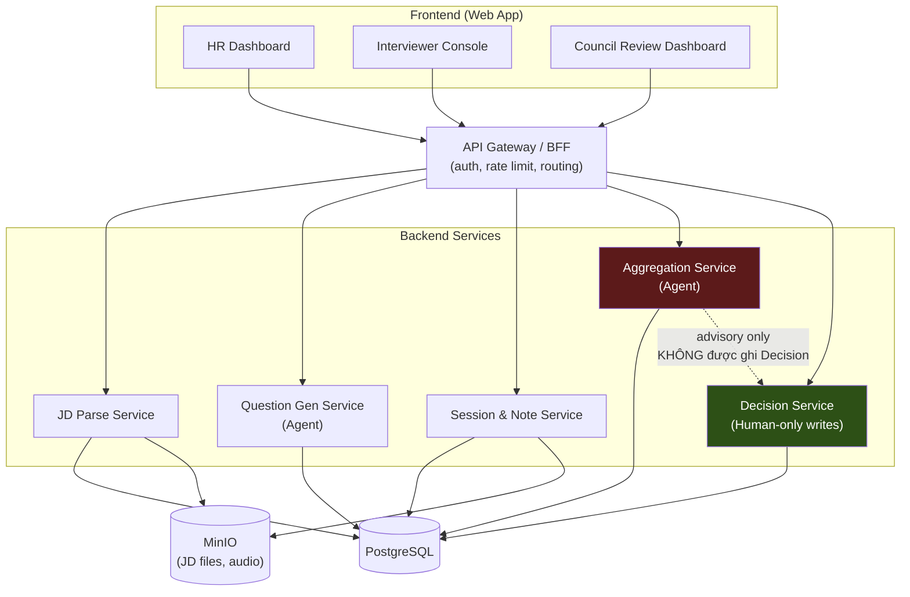
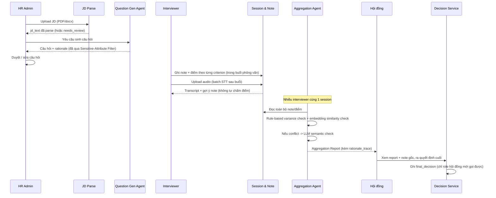
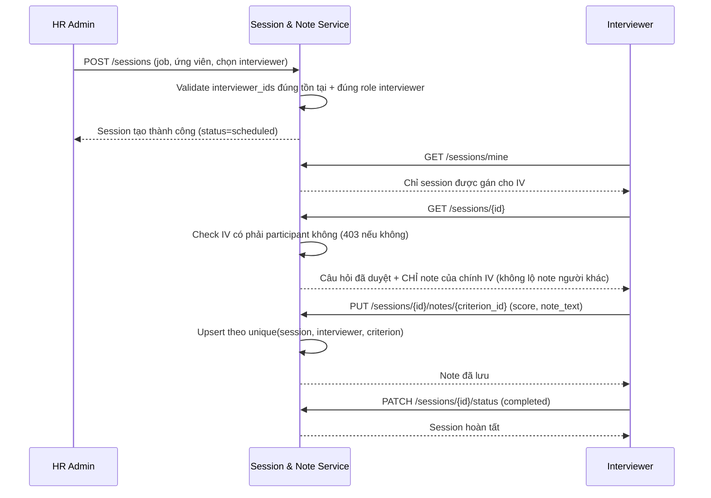

# Kiến trúc hệ thống

## Trạng thái implement theo service

| Service | Trạng thái | Sprint |
|---|---|---|
| Auth (JWT + RBAC) | ✅ Đã có | 3 |
| JD Parse Service | ✅ Đã có | 1 |
| Question Gen Service | ✅ Đã có | 2 |
| Session & Note Service | ✅ Đã có | 3 |
| Aggregation Service | ⏳ Chưa làm | 5 (kế hoạch) |
| Decision Service | ⏳ Chưa làm | 6 (kế hoạch) |

Auth bổ sung 1 lớp kiểm tra trước khi request chạm tới các service ở trên: mọi
endpoint (trừ `/health`, `/auth/login`) đều qua `get_current_user` (giải mã JWT,
load `User`, kiểm tra `is_active`) và phần lớn còn qua `require_role(...)` chặn
theo đúng role cần thiết (VD: chỉ `hr_admin` tạo được Job/Framework/Session; chỉ
interviewer được gán mới đọc/ghi note của session đó).

## Tổng quan

Interview Assist Agent gồm 5 service tách biệt, giao tiếp qua REST API, dùng chung
1 PostgreSQL và 1 MinIO. Nguyên tắc thiết kế cốt lõi: **Aggregation Service không có
quyền ghi vào bảng `Decision`** — chỉ Decision Service (thao tác qua UI bởi hội đồng)
mới ghi được. Đây là cách enforce HITL (Human-In-The-Loop) ở tầng kiến trúc, không
chỉ ở tầng convention hay tài liệu.

## Luồng dữ liệu chính (happy path)

## Vì sao tách Aggregation Report và Decision thành 2 bảng riêng

`Aggregation Report` là **output của AI** — mang tính advisory, có thể sai, phải
luôn kèm `rationale_trace` để giải thích được. `Decision` là **action của người** —
authoritative, không thể bị agent nào ghi đè hay tự động hoá. Tách bảng + tách
service là cách hiện thực hoá ràng buộc HITL bắt buộc ở tầng data model, thay vì
chỉ dựa vào quy ước "đừng tự động hoá" dễ bị vi phạm khi code phát triển thêm.

## Tech stack

| Layer | Công nghệ |
|---|---|
| Backend | FastAPI (Python 3.11) |
| Frontend | React + TypeScript (Vite) |
| Database | PostgreSQL 16 |
| Object Storage | MinIO (S3-compatible, self-host) |
| STT | Whisper self-host (faster-whisper), batch xử lý |
| LLM | Claude API — Question Gen, Aggregation semantic check |
| Embedding | sentence-transformers (self-host) — pre-check trước khi gọi LLM |
| Auth | JWT + RBAC middleware |
| Containerize | Docker + docker-compose |

## Luồng Session & Note (Sprint 3)

## Liên quan

- [Data Model](data-model.md)
- [ADR 0001: Microservice boundaries & HITL enforcement](decisions/0001-microservice-boundaries-and-hitl-enforcement.md)